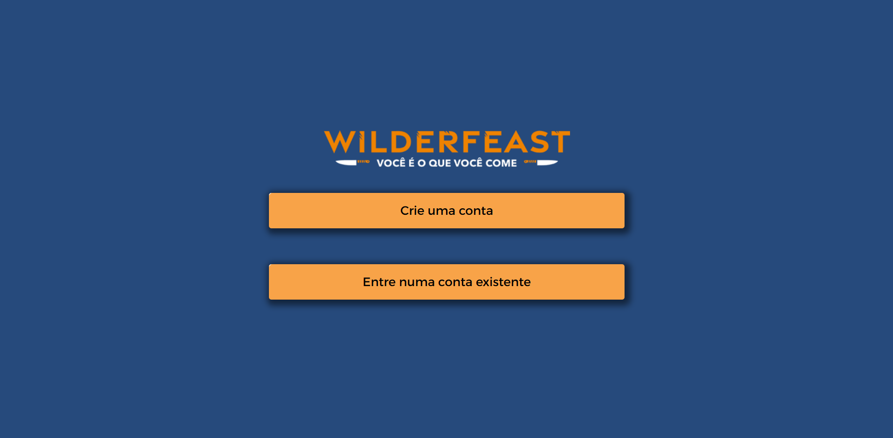
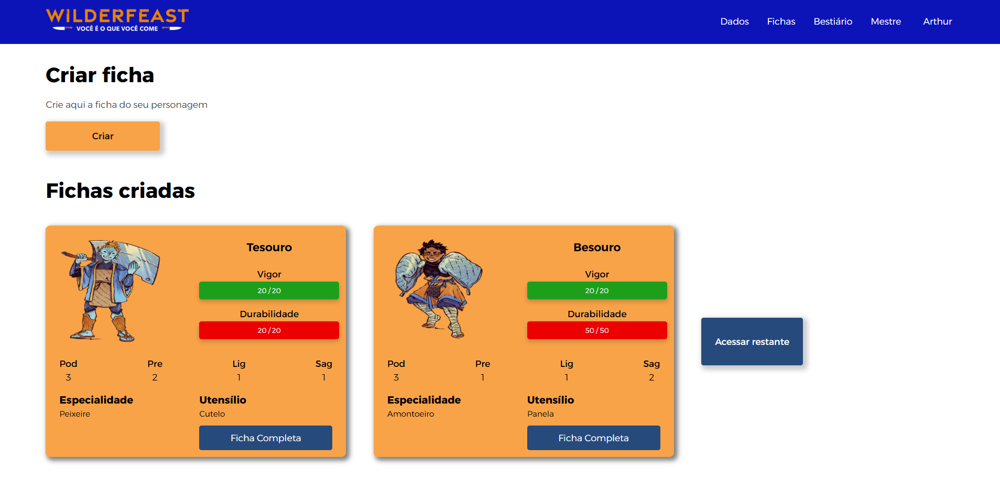
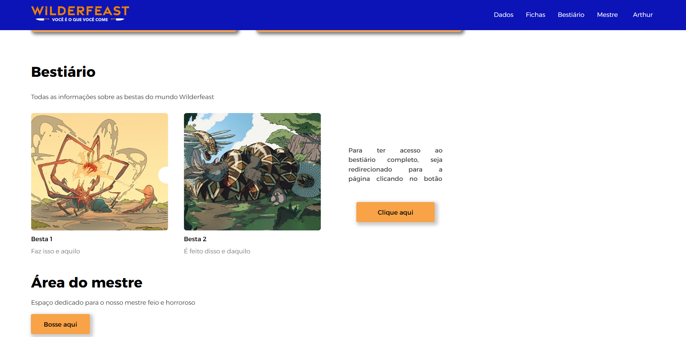
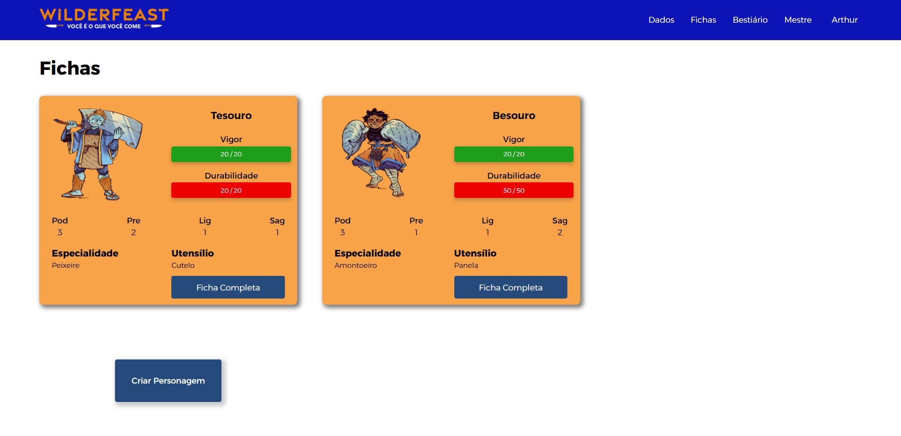
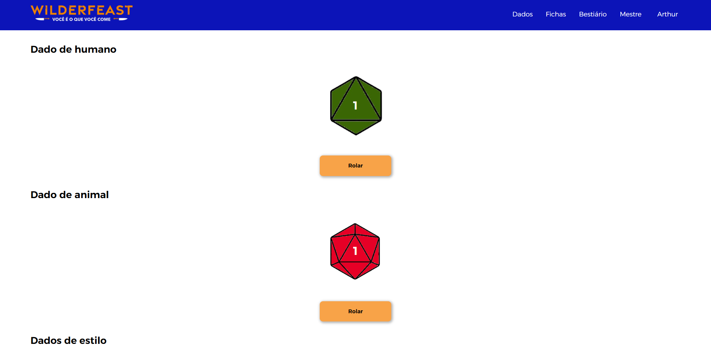
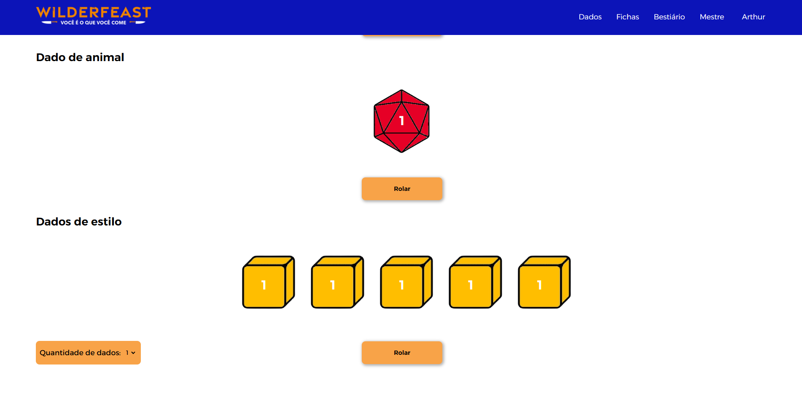

# WilderFeast
Esse projeto WilderFeast busca otimizar a jogabilidade do rpg de mesa com várias funções auxiliares como registro de personagens, registro de feras, dados digitais e diversas outras funcionalidades que com certeza facilitarão as operações dentro do jogo. A aplicação utiliza diversas tecnologias, mas as principais são o flask que é um microframework que trabalhará em conjunto com o banco de dados sqlalchemy que tem a função de organizar os dados, python para estabelecer a lógica de programação, css e html para organizar a estilização e estruturação do site respectivamente e javascript para estabelecer funções que serão executadas dentro do html.


---

# Principais funcionalidades
1. Sistema de login, logout e registro do usuário
2. Sistema de cadastro, edição, remoção e exibição de fichas de personagens e feras
3. Grande variedade de dados para rolagem

---

# Como acessar o site
1. Clonar o repositório github
para clonar o repositório github use o seguinte comando dentro do terminal
```bash
git clone https://github.com/Dargoes/steam_verde.git
```
2. mudar para o repositório
```bash
cd steam_verde
```
3. instalar bibliotecas do projeto e outros requerimentos
```bash
pip install -r requirements.txt
```
4. inicializar o arquivo python
```bash
py app.py
```
---

# Tecnologias Utilizadas
- Flask
- Flask-Login
- Flask-SQLAlchemy
- SQLAlchemy
- Werkzeug

---

# Estruturação do site
## 1. Página inicial



A página inicial apresenta links que referenciam as rotas de registro e de login que cadastram os dados do usuário no banco e consultam os dados respectivamente.

## 2. Página do usuário





A página do usuário é retornada logo após o login e funciona como uma ponte para as outras páginas do projeto que são dados, fichas e bestiário. Além disso ela também consta com o logout do usuário e sessões de criar ficha de personagem, fichas já criadas e uma fração do bestiário e dos personagens

## 3. fichas de personagem




Através das respostas dadas nos formulários de criação de personagens as rotas do python guardam as informações no banco de dados e mostram os personagens de forma organizada dentro da página.

## 4. bestiário


De forma semelhante a página de personagens, o bestiário exibe as bestas já cadastradas os respectivos atributos de cada fera.

## 5. dados




Com o javascript é possível criar funções que fazem uma rolagem de dados de diversos tipos de forma aleatória, muito semelhante à vida real.


## Páginas de registro


Estas são as páginas em que o usuário pode colocar cada dado do seu personagem ou fera e submeter ao registro para ser exibida posteriormente na página do usuário e fichas, caso seja um personagem ou bestiário, caso seja uma fera.
